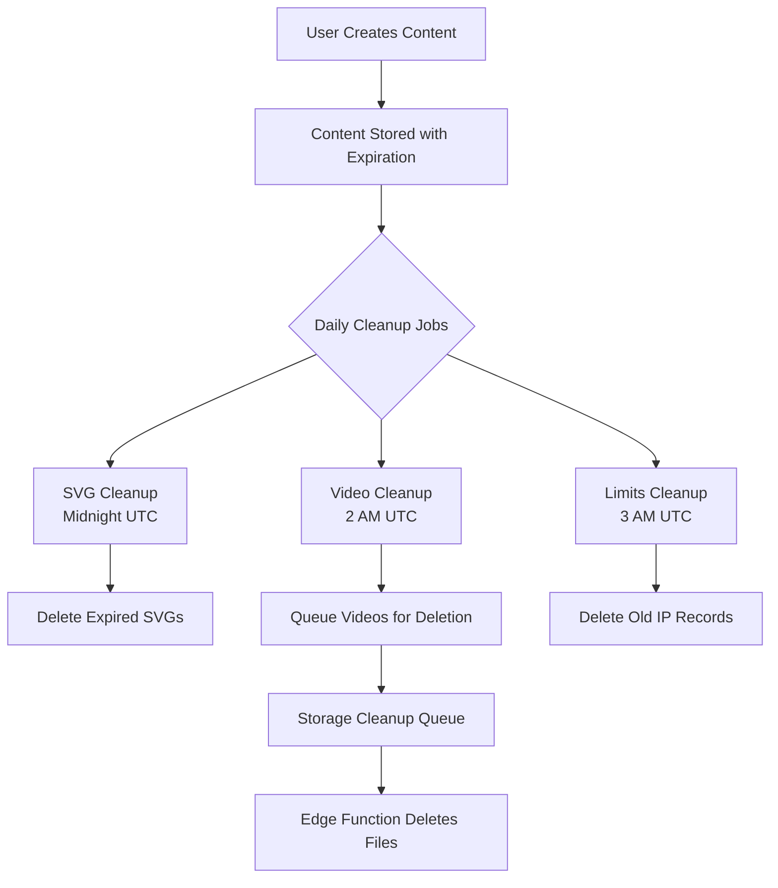

# Admin Dashboard Setup & Cleanup Explanation

## 🎯 Admin Dashboard Access

### Setup Instructions:
1. **Add your user ID to environment variables**:
   ```bash
   # In your .env.local file
   ADMIN_USER_IDS="your-supabase-user-id-here"
   ```
   
2. **Find your user ID**:
   - Go to Supabase Dashboard > Authentication > Users
   - Copy your user's UUID
   
3. **Access the admin dashboard**:
   - Navigate to: `https://your-domain.com/admin`
   - Must be logged in with an admin user

### Admin Dashboard Features:
- **Cleanup Status Monitor**: View expired content counts
- **Manual Cleanup Trigger**: Force immediate cleanup
- **Storage Queue Status**: Monitor pending file deletions
- **Retention Policy Overview**: See current policies

## 📊 Understanding Cleanup Systems

### 1. **SVG Cleanup is NOT Random** ❌
Despite the confusing name, SVG cleanup is actually scheduled:
- **Job Name**: `cleanup-svg-designs`
- **Schedule**: Daily at midnight UTC (`0 0 * * *`)
- **Function**: `cleanup_old_svg_designs()`
- **Status**: ✅ Already running automatically via pg_cron

### 2. **Video Cleanup**
- **Job Name**: `cleanup-expired-videos`
- **Schedule**: Daily at 2 AM UTC (`0 2 * * *`)
- **Function**: `cleanup_expired_videos()`
- **Status**: ✅ Already scheduled via pg_cron

### 3. **Generation Limits Cleanup**
- **Purpose**: Cleans up anonymous user rate limiting data
- **What it does**: Deletes IP-based tracking records older than 7 days
- **Schedule**: Daily at 3 AM UTC (`0 3 * * *`)
- **Why needed**: Prevents the `daily_generation_limits` table from growing forever

## 🔄 Complete Cleanup Flow



## ✅ Current Status

### What's Working:
1. **All cleanup jobs are scheduled** via pg_cron
2. **Retention periods match pricing**:
   - Free/Starter: 7 days
   - Pro: 30 days
3. **Automatic daily cleanup** for all content types
4. **Admin dashboard** for monitoring and manual cleanup

### pg_cron on Free Supabase Plan:
- ✅ **pg_cron IS available** on all Supabase plans (including free)
- ✅ **Already enabled** in your project
- ✅ **6 jobs scheduled** and running

### Current Scheduled Jobs:
```sql
-- Your current cleanup schedule:
1. delete-old-svgs-daily     - Daily at midnight
2. cleanup-svg-designs        - Daily at midnight
3. trigger-storage-cleanup    - Daily at 3 AM
4. cleanup-expired-videos-v2  - Daily at 2 AM
5. cleanup-expired-videos     - Daily at 2 AM
6. cleanup-old-generation-limits - Daily at 3 AM
```

## 🛠️ Manual Cleanup Commands

If you need to run cleanup manually:

```sql
-- In Supabase SQL Editor:

-- Clean up expired SVGs/icons
SELECT cleanup_old_svg_designs();

-- Clean up expired videos
SELECT cleanup_expired_videos();

-- Clean up old generation limits
SELECT cleanup_old_generation_limits();

-- Check cleanup status
SELECT * FROM get_cleanup_status();
```

## 📝 Summary

1. **No action needed** - All cleanup is already automated
2. **"Random" was misleading** - SVG cleanup runs daily at midnight
3. **Admin dashboard available** at `/admin` (requires setup)
4. **pg_cron works on free plan** - Already configured
5. **Everything is consistent** with pricing page claims

The system is working correctly. The only confusion was the function name `trigger_cleanup_old_limits()` which suggested random execution, but it's actually checking scheduled jobs.